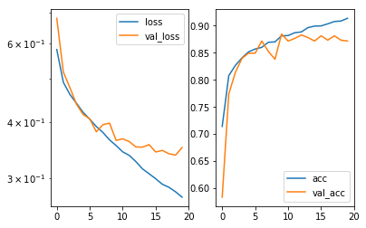
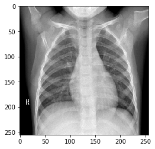
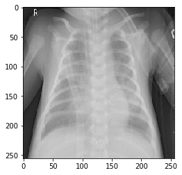
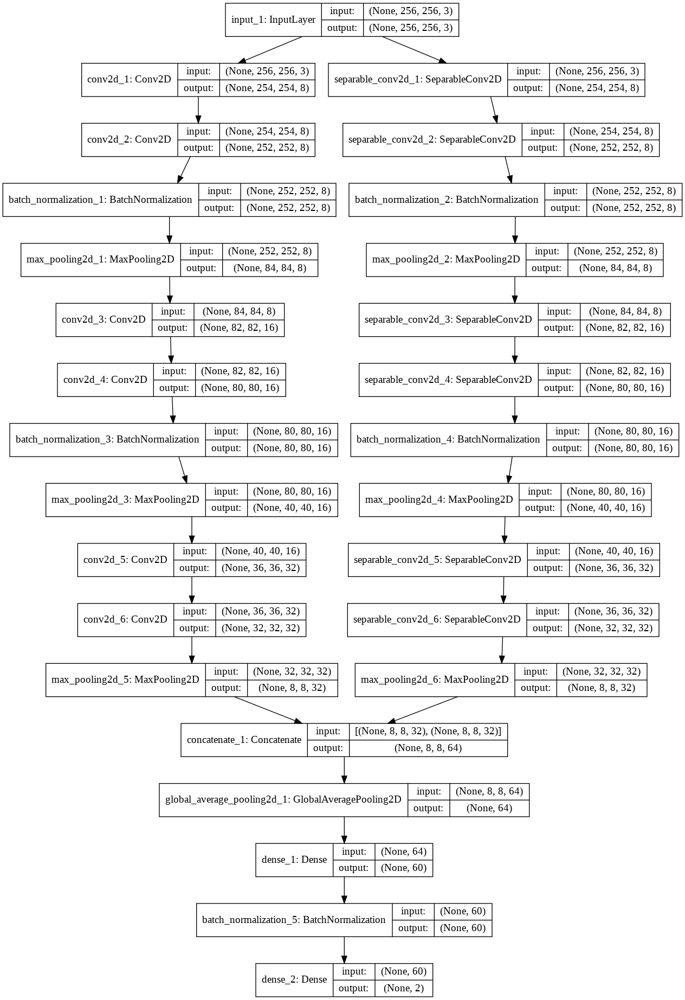

# Pneumonia-Detection-Kaggle-Solution
 Keras implementation for Binary classification problem (Detects Pneumonia by taking X-Ray images of patient chest).

## Accuracy and Loss Graph

## Input Image Samples

### Model Architecture

